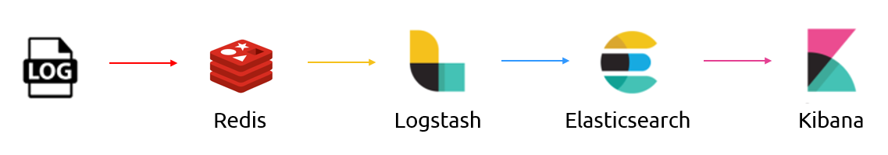
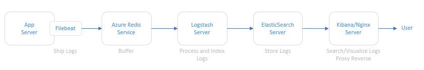
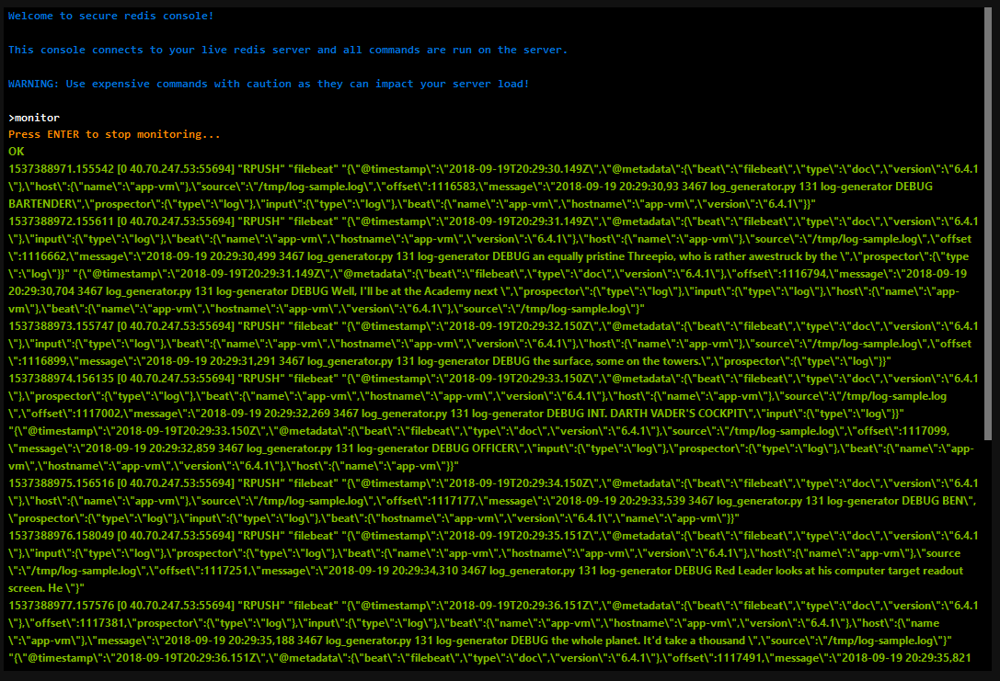
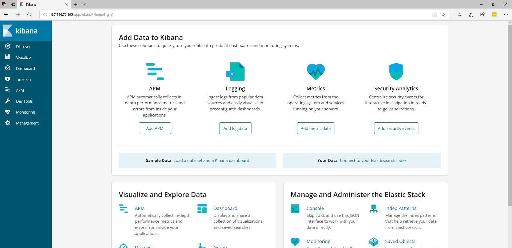
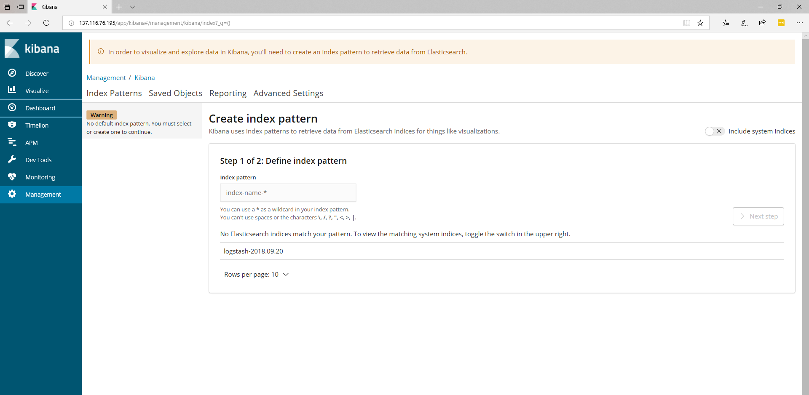
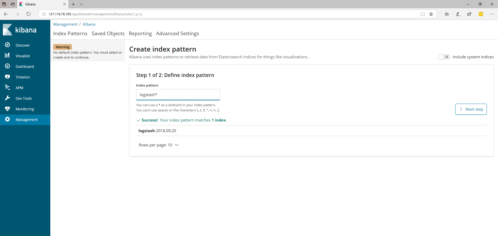
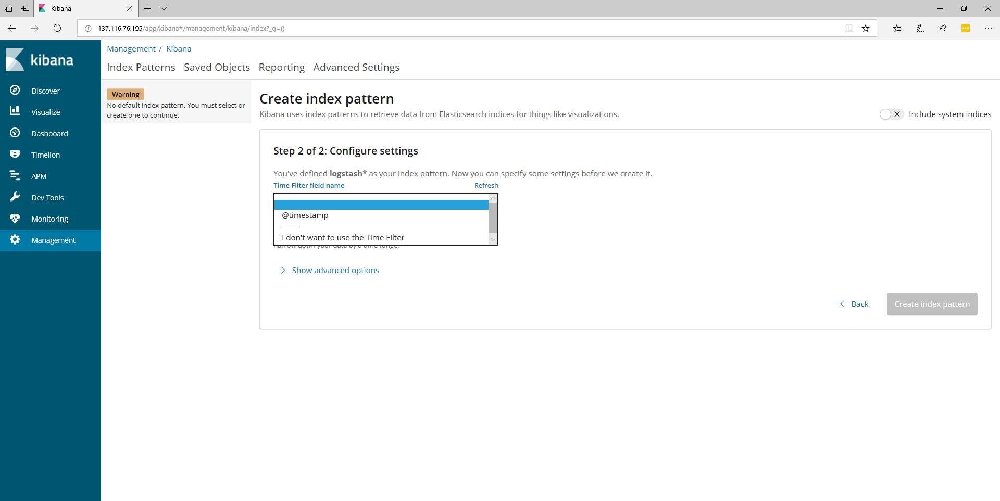
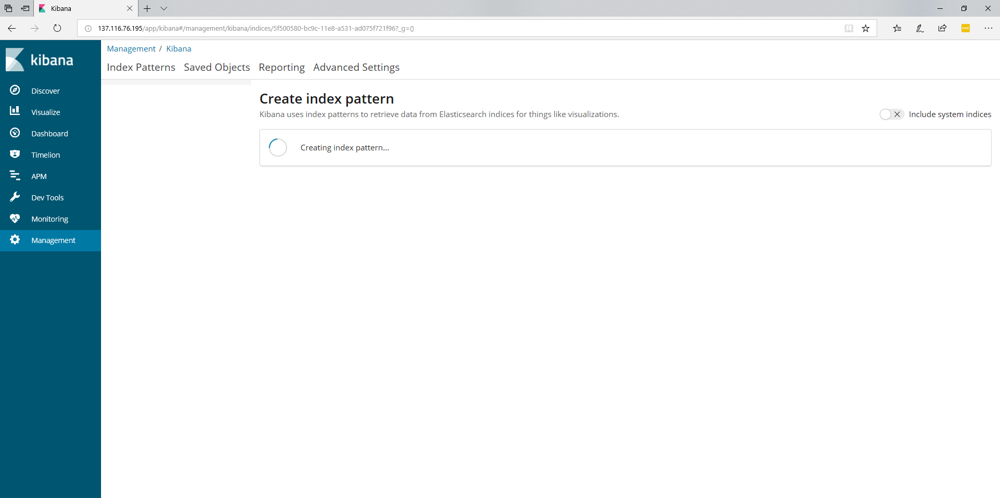
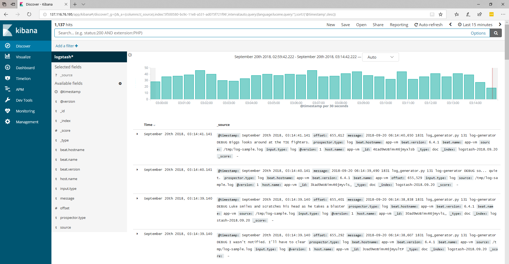
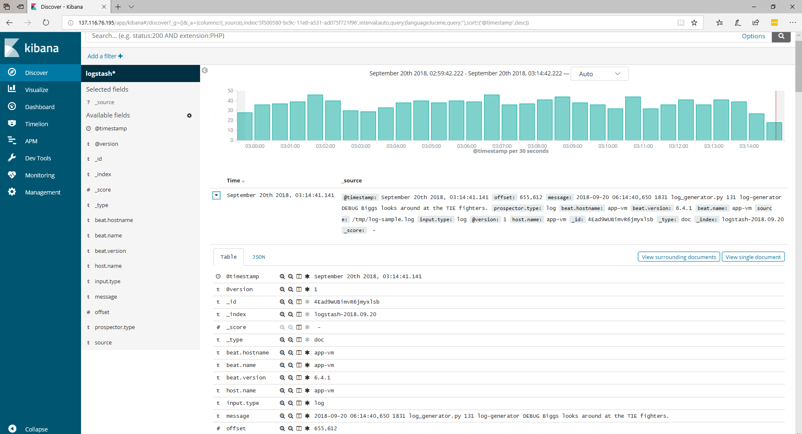

O objetivo deste artigo é descrever de forma detalhada como implementar a Stack ELK (Elasticsearch/Logstash/Kibana) no Azure.

## Introdução



Este artigo é resultado de uma prova de conceito para mostrar a funcionalidade de implementação de toda a stack utilizando a ferramenta de linha de comando do Azure ([az-cli](https://docs.microsoft.com/pt-br/cli/azure))

## Arquitetura

A ilustração abaixo se refere à arquitetura lógica implantada para provar o conceito. Esta arquitetura contempla um servidor de aplicação, o serviço de Redis do Azure, um servidor com o Logstash, um servidor com ElasticSearch e um servidor com o Kibana e serviço web (Nginx) instalados.


Arquitetura ELK

## Descrição dos componentes da arquitetura

- **Servidor de Aplicação:** Para simular um servidor de aplicação gerando logs, foi utilizado um script que gera logs aleatoriamente. O código fonte deste script está disponível em <https://github.com/bitsofinfo/log-generator>. Ele foi configurado para gerar os logs em /tmp/log-sample.log.
- **Filebeat:** Agente instalado no servidor de aplicação e configurado para enviar os logs gerados para o Azure Redis. O Filebeat tem a função de fazer o shipping dos logs usando o protocolo *lumberjack*.
- **Azure Redis Service:** Serviço gerenciado de armazenamento de dados em memória. Foi utilizado pois mecanismos de busca podem ser um pesadelo operacional. A indexação pode derrubar um cluster tradicional e os dados podem acabar sendo reindexados por diversos motivos. Deste modo, a escolha do Redis entre a fonte de eventos e o parsing e processamento é apenas para indexar/parsear tão rápido quanto os nós e os bancos de dados envolvidos possam manipular estes dados permitindo que seja possível extrair diretamente do fluxo de eventos ao invés de ter eventos sendo inseridos no pipeline. Através do Redis Monitor é possível ver exatamente o que está acontecendo no Redis: O Filebeat enviando os dados e o Logstash pedindo por eles:



- **Logstash:** Faz o processamento e a indexação dos logs lendo do Redis e enviando ao ElasticSearch.
- **ElasticSearch:** Faz o armazenamento dos logs
- **Kibana/Nginx:** Interface web para busca e visualização dos logs que são *proxiados* pelo Nginx

## Deployment do Ambiente

O deployment do ambiente é feito usando comandos do Azure CLI em um script shell. Além de servir como uma documentação sobre os serviços que foram implantados, são uma boa prática de infraestrutura como código.

### Instalação do Azure CLI

O pré-requisito é o uso do Azure CLI, cujas instruções de instalação estão contidas de forma detalhada em <https://docs.microsoft.com/en-us/cli/azure/?view=azure-cli-latest>

Para instalar no Ubuntu, basicamente os comandos são:

- Modificar o sources.list:

```
AZ_REPO=$(lsb_release -cs)<br></br>echo "deb [arch=amd64] https://packages.microsoft.com/repos/azure-cli/ $AZ_REPO main" | sudo tee /etc/apt/sources.list.d/azure-cli.list
```

- Obter o Microsoft signin key:

```
curl -L https://packages.microsoft.com/keys/microsoft.asc | sudo apt-key add -
```

- Instalar o CLI:

```
sudo apt-get update
sudo apt-get install apt-transport-https azure-cli
```

- Fazer login:

```
az login
```

Ir até <http://www.microsoft.com/devicelogin> e informar o código de autorização gerado no console.

*\*\* Importante destacar que o login não-interativo só é possível para assinaturas que não estejam fazendo uso de MFA.*


### Setup da Stack ELK

O próximo passo é executar o script de instalação da Stack ELK que por sua vez irá realizar os seguintes passos:

1. Criar o grupo de recursos
2. Criar o serviço do Redis
3. Criar uma VNET chamada myVnet com o prefixo 10.0.0.0/16 e uma subnet chamada mySubnet com o prefixo 10.0.1.0/24
4. Criar a VM do servidor de Aplicação 
    1. Tamanho: Standard\_D2S\_v3
    2. Usuário: &lt;usuarioremotoescolhido&gt;
    3. Chaves SSH: As chaves pública e privada são geradas em ~/.ssh. O acesso é feito diretamente através do comando ssh -i ~/.ssh/id\_rsa &lt;usuarioremotoescolhido&gt;@&lt;ip&gt;
5. Instalação/Configuração do Log Generator
6. Instalação/Configuração do Filebeat
7. Start do Filebeat
8. Criar a VM do servidor de ElasticSearch 
    1. Tamanho: Standard\_D2S\_v3
    2. Usuário: &lt;usuarioremotoescolhido&gt;
    3. Chaves SSH: As chaves pública e privada são geradas em ~/.ssh. O acesso é feito diretamente através do comando ssh -i ~/.ssh/id\_rsa &lt;usuarioremotoescolhido&gt;@&lt;ip&gt;
9. Configurar NSG e liberar acesso na porta 9200 para a subnet 10.0.1.0/24
10. Instalar o Java
11. Instalação/Configuração do ElasticSearch
12. Start do ElasticSearch
13. Criar a VM do servidor do Logstash 
    1. Tamanho: Standard\_D2S\_v3
    2. Usuário: &lt;usuarioremotoescolhido&gt;
    3. Chaves SSH: As chaves pública e privada são geradas em ~/.ssh. O acesso é feito diretamente através do comando ssh -i ~/.ssh/id\_rsa &lt;usuarioremotoescolhido&gt;@&lt;ip&gt;
14. Instalação/Configuração do Logstash
15. Start do Logstash
16. Criar a VM do servidor do Kibana 
    1. Tamanho: Standard\_D2S\_v3
    2. Usuário: &lt;usuarioremotoescolhido&gt;
    3. Chaves SSH: As chaves pública e privada são geradas em ~/.ssh. O acesso é feito diretamente através do comando ssh -i ~/.ssh/id\_rsa &lt;usuarioremotoescolhido&gt;@&lt;ip&gt;
17. Configurar NSG e liberar acesso na porta 80 para 0.0.0.0/0
18. Instalação/Configuração do Kibana
19. Instalação/Configuração do Nginx

### Script de setup da Stack ELK

```bash
#!/bin/bash

# Define variables
rg="$1"
location="$2"
redisname="$3"

# Validate parameters
if [ "$1" = "" ]; then
    echo "Wrong usage! You need inform the parameters."
    echo "Example: ./elk-setup.sh <resource group name> <location> <redis name>"
exit 1
elif [ "$1" != "" ]; then

# Create Resource Group
az group create --name $rg  --location $location

# Create Redis Service
az redis create --name $redisname --resource-group $rg --location $location --sku Standard --vm-size C1 --enable-non-ssl-port

# Get Redis Info
az redis show --resource-group $rg --name $redisname
az redis list-keys --resource-group $rg --name $redisname

# Create VNET
az network vnet create --resource-group $rg --name myVnet --address-prefix 10.0.0.0/16 --subnet-name mySubnet --subnet-prefix 10.0.1.0/24

# Create App VM

## Create VM
az vm create --resource-group $rg --name app-vm \
--size Standard_D2S_v3  \
--image Canonical:UbuntuServer:18.04-LTS:latest  \
--admin-username elk \
--generate-ssh-keys \
--no-wait \
--vnet-name myVnet \
--subnet  mySubnet \
--nsg nsg-app-vm

sleep 60

# Setup Log Generator

az vm run-command invoke -g $rg -n app-vm \
--command-id RunShellScript --scripts "cd /tmp && git clone https://github.com/bitsofinfo/log-generator.git && cd /tmp/log-generator && python ./log_generator.py --logFile /tmp/log-sample.log &"

# Setup Filebeat

redis_host="$(az redis show --resource-group $rg --name $redisname | tail -1 | awk '{ print $2 }')"
redis_primary_key="$(az redis list-keys --resource-group $rg --name $redisname | tail -1 | awk '{ print $2 }')"

az vm run-command invoke -g $rg -n app-vm \
--command-id RunShellScript --scripts "cd /tmp && curl -L -O https://artifacts.elastic.co/downloads/beats/filebeat/filebeat-6.4.1-amd64.deb && sudo dpkg -i filebeat-6.4.1-amd64.deb && sudo /bin/cp /etc/filebeat/filebeat.yml /etc/filebeat/filebeat.yml.ori"

az vm run-command invoke -g $rg -n app-vm \
--command-id RunShellScript --scripts "sudo sed -i.bak 's/enabled: false/enabled: true'/g /etc/filebeat/filebeat.yml"

az vm run-command invoke -g $rg -n app-vm \
--command-id RunShellScript --scripts "sudo sed -i.bak 's/\/var\/log\//\/tmp\/'/g /etc/filebeat/filebeat.yml"

az vm run-command invoke -g $rg -n app-vm \
--command-id RunShellScript --scripts "sudo sed -i.bak 's/setup.kibana/#setup.kibana'/g /etc/filebeat/filebeat.yml"

az vm run-command invoke -g $rg -n app-vm \
--command-id RunShellScript --scripts "sudo sed -i.bak 's/output.elasticsearch/#output.elasticsearch'/g /etc/filebeat/filebeat.yml"

az vm run-command invoke -g $rg -n app-vm \
--command-id RunShellScript --scripts "sudo sed -i.bak 's/hosts/#hosts'/g /etc/filebeat/filebeat.yml"

az vm run-command invoke -g $rg -n app-vm \
--command-id RunShellScript --scripts "cat <<'EOT' >> /etc/filebeat/filebeat.yml
output.redis:
  hosts: ['$redis_host']
  password: '$redis_primary_key'
  key: 'filebeat'
  db: 0
  timeout: 5
EOT"

## Start Filebeat

az vm run-command invoke -g $rg -n app-vm \
--command-id RunShellScript --scripts "sudo service filebeat start"

# Create Elasticsearch VM

## Create VM
az vm create --resource-group $rg --name elasticsearch-vm \
--size Standard_D2S_v3  \
--image Canonical:UbuntuServer:18.04-LTS:latest  \
--admin-username elk \
--generate-ssh-keys \
--no-wait \
--vnet-name myVnet \
--subnet  mySubnet \
--nsg nsg-elasticsearch-vm

sleep 60

## Create NSG Rule

az network nsg rule create --resource-group $rg --nsg-name nsg-elasticsearch-vm \
--name port-9200-rule \
--access Allow \
--protocol Tcp \
--direction Inbound \
--priority 300 \
--source-address-prefix 10.0.1.0/24 \
--source-port-range "*" \
--destination-address-prefix "*" \
--destination-port-range 9200

## Install Java

az vm run-command invoke -g $rg -n elasticsearch-vm \
--command-id RunShellScript --scripts "sudo add-apt-repository -y ppa:webupd8team/java && sudo apt-get update"

az vm run-command invoke -g $rg -n elasticsearch-vm \
--command-id RunShellScript --scripts "echo oracle-java8-installer shared/accepted-oracle-license-v1-1 select true | sudo debconf-set-selections && sudo apt-get -y install oracle-java8-installer"

## Install Elasticsearch

az vm run-command invoke -g $rg -n elasticsearch-vm \
--command-id RunShellScript --scripts "wget -qO - https://artifacts.elastic.co/GPG-KEY-elasticsearch | sudo apt-key add -"

az vm run-command invoke -g $rg -n elasticsearch-vm \
--command-id RunShellScript --scripts "sudo apt-get install apt-transport-https"

az vm run-command invoke -g $rg -n elasticsearch-vm \
--command-id RunShellScript --scripts "cat <<'EOT' >> /etc/apt/sources.list.d/elastic-6.x.list
deb https://artifacts.elastic.co/packages/6.x/apt stable main
EOT"

az vm run-command invoke -g $rg -n elasticsearch-vm \
--command-id RunShellScript --scripts "sudo apt-get update && sudo apt-get install elasticsearch"


## Configure Elasticsearch

az vm run-command invoke -g $rg -n elasticsearch-vm \
--command-id RunShellScript --scripts "sudo /bin/cp /etc/elasticsearch/elasticsearch.yml /etc/elasticsearch/elasticsearch.yml.ori && > /etc/elasticsearch/elasticsearch.yml"

az vm run-command invoke -g $rg -n elasticsearch-vm \
--command-id RunShellScript --scripts "cat <<'EOT' >> /etc/elasticsearch/elasticsearch.yml
network.host: 0.0.0.0
path.data: /var/lib/elasticsearch
path.logs: /var/log/elasticsearch
EOT"

## Start ElasticSearch

az vm run-command invoke -g $rg -n elasticsearch-vm \
--command-id RunShellScript --scripts "sudo systemctl enable elasticsearch.service && sudo systemctl start elasticsearch.service"


# Create Logstash VM

## Create VM
az vm create --resource-group $rg --name logstash-vm \
--size Standard_D2S_v3  \
--image Canonical:UbuntuServer:18.04-LTS:latest  \
--admin-username elk \
--generate-ssh-keys \
--no-wait \
--vnet-name myVnet \
--subnet  mySubnet \
--nsg nsg-logstash-vm

sleep 60

az vm run-command invoke -g $rg -n logstash-vm \
--command-id RunShellScript --scripts "sudo add-apt-repository -y ppa:webupd8team/java && sudo apt-get update"

az vm run-command invoke -g $rg -n logstash-vm \
--command-id RunShellScript --scripts "echo oracle-java8-installer shared/accepted-oracle-license-v1-1 select true | sudo debconf-set-selections && sudo apt-get -y install oracle-java8-installer"

## Install Logstash

az vm run-command invoke -g $rg -n logstash-vm \
--command-id RunShellScript --scripts "wget -qO - https://artifacts.elastic.co/GPG-KEY-elasticsearch | sudo apt-key add -"

az vm run-command invoke -g $rg -n logstash-vm \
--command-id RunShellScript --scripts "sudo apt-get install apt-transport-https"

az vm run-command invoke -g $rg -n logstash-vm \
--command-id RunShellScript --scripts "cat <<'EOT' >> /etc/apt/sources.list.d/elastic-6.x.list
deb https://artifacts.elastic.co/packages/6.x/apt stable main
EOT"

az vm run-command invoke -g $rg -n logstash-vm \
--command-id RunShellScript --scripts "sudo apt-get update && sudo apt-get install logstash"


# Configure Logstash

redis_host="$(az redis show --resource-group $rg --name $redisname | tail -1 | awk '{ print $2 }')"
redis_primary_key="$(az redis list-keys --resource-group $rg --name $redisname | tail -1 | awk '{ print $2 }')"
elasticsearch_host="$(az vm show -g $rg  -n elasticsearch-vm -d --query privateIps -otsv)"

az vm run-command invoke -g $rg -n logstash-vm \
--command-id RunShellScript --scripts "cat <<'EOT' >> /etc/logstash/conf.d/logstash.conf
# Logstash Config
input {
        redis {
                host        => \"$redis_host\"
                port        => \"6379\"
                password    => \"$redis_primary_key\"
                db          => \"0\"
                data_type   => \"list\"
                key         => \"filebeat\"
        }
}
output {
  elasticsearch {
    hosts => [\"http://$elasticsearch_host:9200\"]
    }
}
EOT"

## Start Logstash

az vm run-command invoke -g $rg -n logstash-vm \
--command-id RunShellScript --scripts "sudo systemctl enable logstash.service && sudo systemctl start logstash.service"


# Create Kibana VM

az vm create --resource-group $rg --name kibana-vm \
--size Standard_D2S_v3  \
--image Canonical:UbuntuServer:18.04-LTS:latest  \
--admin-username elk \
--generate-ssh-keys \
--no-wait \
--vnet-name myVnet \
--subnet  mySubnet \
--nsg nsg-kibana-vm

sleep 60

## Create NSG Rule
az network nsg rule create --resource-group $rg --nsg-name nsg-kibana-vm \
--name port-80-rule \
--access Allow \
--protocol Tcp \
--direction Inbound \
--priority 300 \
--source-address-prefix Internet \
--source-port-range "*" \
--destination-address-prefix "*" \
--destination-port-range 80

## Install Kibana

az vm run-command invoke -g $rg -n kibana-vm \
--command-id RunShellScript --scripts "wget -qO - https://artifacts.elastic.co/GPG-KEY-elasticsearch | sudo apt-key add -"

az vm run-command invoke -g $rg -n kibana-vm \
--command-id RunShellScript --scripts "cat <<'EOT' >> /etc/apt/sources.list.d/elastic-6.x.list
deb https://artifacts.elastic.co/packages/6.x/apt stable main
EOT"

az vm run-command invoke -g $rg -n kibana-vm \
--command-id RunShellScript --scripts "sudo apt-get update && sudo apt-get install kibana"

az vm run-command invoke -g $rg -n kibana-vm \
--command-id RunShellScript --scripts "sudo /bin/systemctl daemon-reload && sudo /bin/systemctl enable kibana.service"

az vm run-command invoke -g $rg -n kibana-vm \
--command-id RunShellScript --scripts "sudo /bin/cp /etc/kibana/kibana.yml /etc/kibana/kibana.yml.ori && > /etc/kibana/kibana.yml"

az vm run-command invoke -g $rg -n kibana-vm \
--command-id RunShellScript --scripts "cat <<EOT >> /etc/kibana/kibana.yml
server.host: "localhost"
server.port: 5601
elasticsearch.url: http://"$elasticsearch_host:9200"
EOT"

## Start Kibana

az vm run-command invoke -g $rg -n kibana-vm \
--command-id RunShellScript --scripts "sudo systemctl start kibana.service"

## Install Nginx

az vm run-command invoke -g $rg -n kibana-vm \
--command-id RunShellScript --scripts "sudo apt-get -y install nginx"

az vm run-command invoke -g $rg -n kibana-vm \
--command-id RunShellScript --scripts "> /etc/nginx/sites-available/default"

az vm run-command invoke -g $rg -n kibana-vm \
--command-id RunShellScript --scripts "cat <<'EOT' >> /etc/nginx/sites-available/default
# Nginx Config
    server {
        listen 80;
        server_name _;
        location / {
            proxy_pass http://localhost:5601;
            proxy_http_version 1.1;
            proxy_set_header Upgrade \$http_upgrade;
            proxy_set_header Connection 'upgrade';
            proxy_set_header Host \$host;
            proxy_cache_bypass \$http_upgrade;
        }
    }
EOT"

## Start Nginx

az vm run-command invoke -g $rg -n kibana-vm \
--command-id RunShellScript --scripts "sudo systemctl restart nginx"

fi
exit
```

## Finalizando o Setup

Para finalizar o setup, o próximo passo consiste em conectar no endereço IP público da VM do Kibana/Nginx. Uma vez conectado, a tela inicial deverá ser semelhante à esta:



O próximo passo é clicar em **Discover** onde iremos criar o padrão de indexação:



Neste caso será criado o padrão **logstash\***









Agora clicando em ****Discover**** novamente já é possível ver os logs indexados e as mensagens geradas pelo Log Generator:





Até o próximo artigo ;-D
